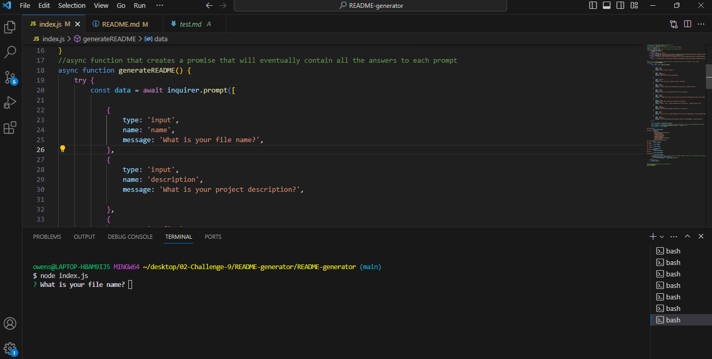

# README-generator
## Description

The purpose of this challenge was to create a command-line application in node using the inquirer package. This program was designed to make it easier for developers to create a README file using command-line prompts. This allows the project creator to devote more time to working on the project. The project demonstrated the use of node to create a program written in Javascript. 

The acceptance criteria were as follows: 

GIVEN a command-line application that accepts user input
WHEN I am prompted for information about my application repository
THEN a high-quality, professional README.md is generated with the title of my project and sections entitled Description, Table of Contents, Installation, Usage, License, Contributing, Tests, and Questions
WHEN I enter my project title
THEN this is displayed as the title of the README
WHEN I enter a description, installation instructions, usage information, contribution guidelines, and test instructions
THEN this information is added to the sections of the README entitled Description, Installation, Usage, Contributing, and Tests
WHEN I choose a license for my application from a list of options
THEN a badge for that license is added near the top of the README and a notice is added to the section of the README entitled License that explains which license the application is covered under
WHEN I enter my GitHub username
THEN this is added to the section of the README entitled Questions, with a link to my GitHub profile
WHEN I enter my email address
THEN this is added to the section of the README entitled Questions, with instructions on how to reach me with additional questions
WHEN I click on the links in the Table of Contents
THEN I am taken to the corresponding section of the README

All criteria were met and the program functions as expected. 

I know how to utilize the node environment to create a program using dynamic Javascript. There were helpful error messages in the terminal to direct porgress. The inquirer documentation was relatively easy to unpack but I did have a few questions that I posed to my tutor. Initially the prompt was not contained in an async function which made it impossible to generate a file and complete successfully. Most of the components were there but through trial and error, I was able to organize the code blocks so that they ran as expected. This recurring issue of needing to organize code so that it can be read and debugged is vitally important. Previous eureka moments were just as valuable here - reformatting code, implementing clear naming convention, and notating often.  I am still working to make this a natural part of the build process. 

## Usage

The js file can be used to understand the dynamic code that supports the application. A link to the deployed program and mockup are listed below, for your convenience. 

## Credits
The project was completed with help from the course materials and assistance from Bootcamp tutor, Erik Hirsch.

## License

MIT License
Copyright (c) [2023] [Amber Watson]

Permission is hereby granted, free of charge, to any person obtaining a copy of this software and associated documentation files (the "Software"), to deal in the Software without restriction, including without limitation the rights to use, copy, modify, merge, publish, distribute, sublicense, and/or sell copies of the Software, and to permit persons to whom the Software is furnished to do so, subject to the following conditions:

The above copyright notice and this permission notice shall be included in all copies or substantial portions of the Software.

THE SOFTWARE IS PROVIDED "AS IS", WITHOUT WARRANTY OF ANY KIND, EXPRESS OR IMPLIED, INCLUDING BUT NOT LIMITED TO THE WARRANTIES OF MERCHANTABILITY, FITNESS FOR A PARTICULAR PURPOSE AND NONINFRINGEMENT. IN NO EVENT SHALL THE AUTHORS OR COPYRIGHT HOLDERS BE LIABLE FOR ANY CLAIM, DAMAGES OR OTHER LIABILITY, WHETHER IN AN ACTION OF CONTRACT, TORT OR OTHERWISE, ARISING FROM, OUT OF OR IN CONNECTION WITH THE SOFTWARE OR THE USE OR OTHER DEALINGS IN THE SOFTWARE.
